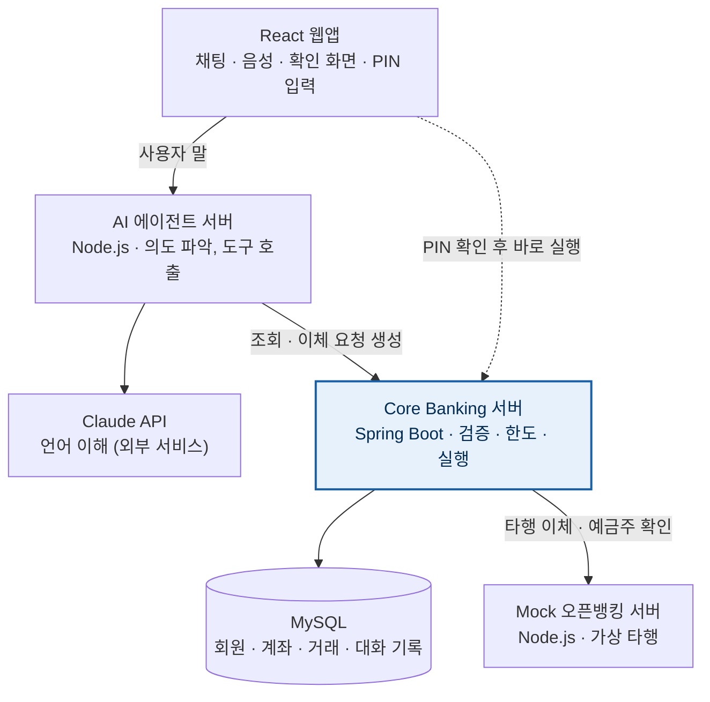
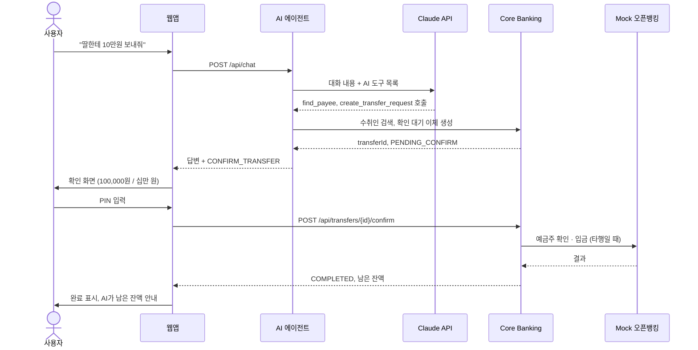

# Talking Bank 시스템 구조도

서버는 4개(웹앱, AI 에이전트, Core Banking, Mock 오픈뱅킹)와 MySQL이고, 돈을 움직이는 것은 Core Banking 하나뿐입니다.

## 서버 구성

파란색으로 강조된 Core Banking만 돈을 움직입니다. 점선은 웹이 PIN과 함께 이체 실행을 직접 요청하는 길로, AI 에이전트를 거치지 않습니다.

## 구성 요소

| 구성 요소 | 기술 | 역할 | 담당 |
| --- | --- | --- | --- |
| React 웹앱 | React | 채팅·음성 화면, 이체 확인 화면, PIN 입력 | 프론트 2명 |
| AI 에이전트 서버 | Node.js + Claude API | 말 이해, AI 도구 호출, 대화 기록 | AI 1명 |
| Core Banking 서버 | Spring Boot | 회원·계좌·이체·한도, 유일하게 돈을 실행 | 백엔드 2명 |
| Mock 오픈뱅킹 서버 | Node.js | 가상 타행, 예금주 확인·입금 | Mock·인프라 1명 |
| MySQL | MySQL 8 + docker-compose | 데이터 저장 | 인프라 |

## AI 이체가 지나가는 길 (S1 기준)

1. 사용자가 말하면 브라우저가 글자로 바꾸고, 웹이 `POST /api/chat`을 호출
2. AI 에이전트가 대화 내용과 AI 도구 목록을 Claude API에 전달
3. Claude가 `find_payee`로 "딸"을 찾고 `create_transfer_request`를 호출 → Core Banking이 한도·잔액을 검사해 확인 대기 이체 생성
4. AI 에이전트가 답변과 `CONFIRM_TRANSFER` 행동을 웹에 돌려줌
5. 웹이 확인 화면을 띄우고, 사용자가 PIN을 입력하면 웹이 `POST /api/transfers/{id}/confirm`을 직접 호출
6. Core Banking이 PIN을 검증하고 실행. 타행이면 Mock 오픈뱅킹에서 예금주 확인 후 입금하고 거래내역 기록
7. 웹이 완료를 표시하고 AI가 남은 잔액을 안내
