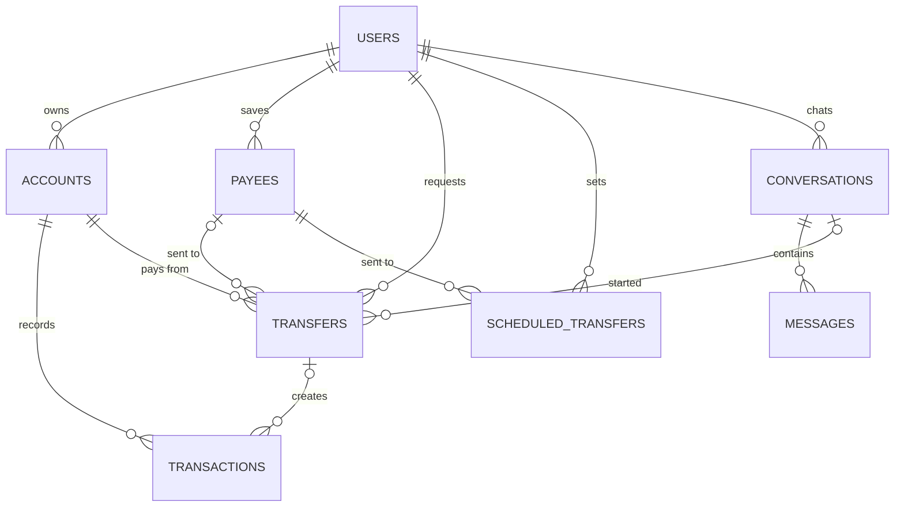

# Talking Bank ERD

Sep 29, 2026 · @전민욱

테이블은 8개입니다. 핵심은 `transfers`가 '이체 요청서'로서 상태(확인 대기 → 완료/취소/만료)를 갖고, 돈이 실제로 움직이면 그때 `transactions`에 기록이 남는다는 점입니다.

## users (회원, 기존 테이블에 추가할 컬럼만)

| 컬럼 | 타입 | 설명 |
| --- | --- | --- |
| `pin_hash` | VARCHAR(255) | PIN의 BCrypt 해시, 미등록이면 NULL |
| `pin_fail_count` | INT | PIN 연속 오류 횟수, 5회면 잠금 |
| `senior_mode` | BOOLEAN | 고령자 모드 사용 여부 (선택 기능) |

## accounts (계좌)

| 컬럼 | 타입 | 설명 |
| --- | --- | --- |
| `id` | BIGINT PK |  |
| `user_id` | BIGINT FK | 계좌 주인 |
| `account_number` | VARCHAR(20) UNIQUE | 계좌번호 |
| `nickname` | VARCHAR(30) | "생활비" 등 계좌 별명 |
| `type` | VARCHAR(20) | CHECKING(입출금), SAVINGS(적금) |
| `balance` | BIGINT | 잔액 (원) |
| `is_primary` | BOOLEAN | 대표 출금 계좌 |
| `status` | VARCHAR(20) | ACTIVE, CLOSED |
| `created_at` | DATETIME |  |

## payees (수취인 별명)

| 컬럼 | 타입 | 설명 |
| --- | --- | --- |
| `id` | BIGINT PK |  |
| `user_id` | BIGINT FK |  |
| `alias` | VARCHAR(30) | "엄마", "딸" (사용자별 UNIQUE) |
| `name` | VARCHAR(50) | 예금주 실명 |
| `bank_code` | VARCHAR(10) | 은행 코드 (자행/Mock 타행) |
| `account_number` | VARCHAR(20) | 받는 계좌 |
| `last_sent_at` | DATETIME | 마지막 송금 시각 (최근 수취인 정렬, 신규 여부 판단) |
| `created_at` | DATETIME |  |

## transfers (이체 요청서)

| 컬럼 | 타입 | 설명 |
| --- | --- | --- |
| `id` | BIGINT PK |  |
| `user_id` | BIGINT FK |  |
| `from_account_id` | BIGINT FK | 출금 계좌 |
| `payee_id` | BIGINT FK NULL | 별명으로 보낼 때 |
| `to_bank_code`, `to_account_number`, `to_name` | VARCHAR | 받는 쪽 정보 (별명이 나중에 바뀌어도 기록 유지) |
| `amount` | BIGINT | 금액 (원) |
| `status` | VARCHAR(20) | PENDING\_CONFIRM, COMPLETED, CANCELED, EXPIRED, FAILED |
| `source` | VARCHAR(10) | AI, MANUAL |
| `risk_level` | VARCHAR(10) | NORMAL, WARNING (보이스피싱 의심) |
| `conversation_id` | BIGINT FK NULL | 어느 대화에서 생겼는지 |
| `idempotency_key` | VARCHAR(64) UNIQUE NULL | 중복 실행 방지 |
| `expires_at` | DATETIME | 확인 마감 (생성 + 5분) |
| `confirmed_at` | DATETIME NULL |  |
| `created_at` | DATETIME |  |

## transactions (거래내역)

| 컬럼 | 타입 | 설명 |
| --- | --- | --- |
| `id` | BIGINT PK |  |
| `account_id` | BIGINT FK |  |
| `transfer_id` | BIGINT FK NULL | 이체로 생긴 거래일 때 |
| `type` | VARCHAR(20) | DEPOSIT, WITHDRAWAL, TRANSFER\_IN, TRANSFER\_OUT |
| `amount` | BIGINT |  |
| `balance_after` | BIGINT | 거래 후 잔액 |
| `counterparty_name` | VARCHAR(50) | 상대방·가맹점 이름 |
| `category` | VARCHAR(20) | 식비, 배달, 교통 등 (소비 요약용) |
| `memo` | VARCHAR(100) | AI에게는 데이터로만 전달 (NFR-05) |
| `created_at` | DATETIME | 거래 시각 (인덱스: account\_id + created\_at) |

## scheduled\_transfers (예약·반복 이체)

| 컬럼 | 타입 | 설명 |
| --- | --- | --- |
| `id` | BIGINT PK |  |
| `user_id`, `from_account_id`, `payee_id` | BIGINT FK |  |
| `amount` | BIGINT |  |
| `cycle` | VARCHAR(10) | ONCE, WEEKLY, MONTHLY |
| `day_of_month` | TINYINT NULL | 매달 며칠 |
| `next_run_at` | DATETIME | 다음 실행 시각 |
| `status` | VARCHAR(20) | PENDING\_CONFIRM, ACTIVE, CANCELED |

## conversations / messages (대화 기록)

| 테이블 | 주요 컬럼 | 설명 |
| --- | --- | --- |
| conversations | `id`, `user_id`, `started_at` | 대화 한 묶음 |
| mesdlsages | `id`, `conversation_id`, `role`(USER/ASSISTANT/TOOL), `content`, `tool_name`, `created_at` | 말 한 줄씩, AI 도구 호출도 기록 (NFR-07) |

담당 메모: conversations·messages는 AI 에이전트 서버가 쓰고, 나머지는 Core Banking이 씁니다. 같은 MySQL을 쓸지 DB를 나눌지는 인프라 담당과 정합니다.
