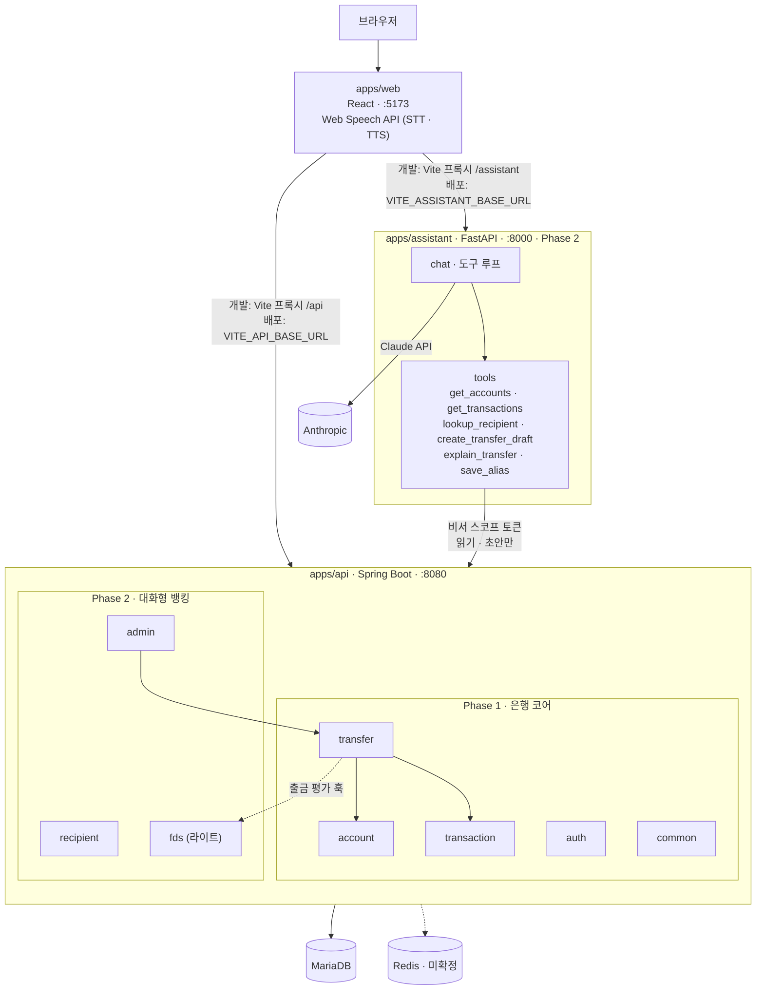

# 03. 기술 스택과 아키텍처

> 무엇을 쓰고 어떻게 배치되는지. 코드 규칙은 [conventions/](conventions/backend.md), 도메인 규칙은 [04-domain.md](04-domain.md)에 있다.

## 한눈에 보기

| 영역        | 선택                                              | 비고                                                                       |
| ----------- | ------------------------------------------------- | -------------------------------------------------------------------------- |
| 백엔드      | **Spring Boot 3.5.x (LTS)** · Java 21             | 아래 "버전 결정" 참고                                                      |
| 보안        | Spring Security 6 · JWT (HS256)                   | Step 1-1 `AUTH-03`에서 도입. 정책은 [06-conventions.md](06-conventions.md) |
| 데이터      | Spring Data JPA (Hibernate) · **MariaDB 11.4**    | **지금은 인메모리 H2.** MariaDB는 Step 1-1 `AUTH-01`에서 도입              |
| 캐시/토큰   | Redis (Refresh Token 저장소)                      | **미확정** — 인증 설계 때 결정                                             |
| AI 서비스   | **Python 3.12 · FastAPI · `anthropic` SDK**       | Phase 2. 모델은 아래 "AI 서비스" 참고                                      |
| 프론트엔드  | **React 19 · TypeScript · Vite**                  |                                                                            |
| 라우팅/상태 | React Router · TanStack Query                     | 전역 상태 라이브러리는 필요해질 때 추가                                    |
| 테스트      | JUnit 5 + MockMvc (H2) · Vitest + Testing Library |                                                                            |
| 코드 품질   | ESLint · Prettier                                 | 백엔드 포매터는 미정 (Spotless 등 검토)                                    |
| 인프라      | Docker Compose                                    | Step 1-1 `AUTH-01`에서 도입. 로컬: MariaDB(+Redis). 배포: 서버 1대         |
| 빌드        | Gradle 9 (멀티프로젝트) · npm workspaces          | 두 빌드는 결합하지 않는다                                                  |

## 모노레포 구조

```
talking-bank/
├── apps/
│   ├── api/          # Spring Boot — 계좌·송금과 확장 도메인. 돈을 다루는 쪽
│   ├── web/          # React — 고객 화면 + 관리자 화면 + AI 비서 패널
│   └── assistant/    # FastAPI — 모델 호출·도구 루프. 돈을 만지지 않는 쪽 (Phase 2)
├── packages/         # 앱 사이 공유 코드 (아직 비어 있음)
├── docs/             # 이 문서들
├── build.gradle      # 플러그인 버전만 선언
├── settings.gradle   # include 'apps:api'
└── package.json      # npm workspaces
```

JVM 모듈은 Gradle이, 프론트엔드는 npm workspaces가, AI 서비스는 `uv`(또는 `pip`)가 관리한다. 세 빌드는 결합하지 않는다.

## 아키텍처



돈이 움직이는 길은 `transfer` 하나뿐이다. AI 서비스는 `transfer`의 초안(`DRAFT`)만 만들고 실행은 부르지 못한다. 향후 확장 도메인(상품·카드·증권·보험)도 전부 `transfer`로 모이도록 자리를 열어둔다.

| 패키지        | 역할                             | Phase                        |
| ------------- | -------------------------------- | ---------------------------- |
| `auth`        | 회원·JWT                         | [1](domains/01-core.md)      |
| `account`     | 계좌·잔액                        | [1](domains/01-core.md)      |
| `transfer`    | 송금 — 트랜잭션·락·출금 평가 훅  | [1](domains/01-core.md)      |
| `transaction` | 거래내역                         | [1](domains/01-core.md)      |
| `common`      | 예외·에러 응답·설정              | [1](domains/01-core.md)      |
| `recipient`   | 수취인 별칭                      | [2](domains/02-assistant.md) |
| `fds`         | 규칙 2개 (출금 평가 훅의 구현체) | [2](domains/02-assistant.md) |
| `admin`       | 관리자 AI 비서 대시보드          | [2](domains/02-assistant.md) |

향후 확장 후보(`product` · `batch` · `openbanking` · `card` · `securities` · `insurance`)는 [02-scope.md](02-scope.md#향후-확장-후보)에 있다.

## AI 서비스

`apps/assistant`는 말을 다루고, `apps/api`는 돈을 다룬다. 둘을 분리하는 이유는 [02-assistant.md 원칙](domains/02-assistant.md#원칙)에 있다. 코드 규칙은 [conventions/assistant.md](conventions/assistant.md).

| 항목              | 결정                                                                                                                     |
| ----------------- | ------------------------------------------------------------------------------------------------------------------------ |
| 언어 · 프레임워크 | Python 3.12 · FastAPI. AI 담당이 프롬프트·평가를 Python으로 다루고, 인프라 계획(FastAPI AI 서버)과 맞다                  |
| 모델              | `claude-opus-5`. 적응형 사고(`thinking: adaptive`). `effort`는 평가 세트로 정한다(기본 `high`)                           |
| 호출 방식         | Messages API + 도구 사용, 스트리밍. 시스템 프롬프트·도구 정의는 프롬프트 캐싱                                            |
| 도구 실행         | AI 서비스가 직접 `apps/api`를 부른다. 서버 사이드 도구(웹 검색·코드 실행)는 쓰지 않는다                                  |
| 인증              | 사용자 JWT를 `apps/api`와 같은 HS256 시크릿으로 검증한 뒤, `apps/api`에서 **비서 스코프 토큰**(5분)을 받아 코어를 부른다 |
| 음성              | 브라우저 Web Speech API. 서버는 텍스트만 다룬다                                                                          |
| 비용              | 요청당 약 $0.02(입력 3천 · 출력 3백 토큰 기준). 일일 상한 POL-055                                                        |
| 테스트            | 모델 호출은 목킹. 평가 세트만 실제 호출                                                                                  |

## 포트와 환경

| 서비스    | 개발 포트 | 환경 변수                                                                                                           |
| --------- | --------- | ------------------------------------------------------------------------------------------------------------------- |
| web       | 5173      | `VITE_API_BASE_URL`, `VITE_API_PROXY_TARGET`                                                                        |
| api       | 8080      | 지금은 없음. `DB_URL` · `DB_USERNAME` · `DB_PASSWORD` · `CORS_ALLOWED_ORIGINS` · `JPA_DDL_AUTO`는 Step 1-1에서 추가 |
| MariaDB   | **3308**  | Step 1-1에서 도입. 호스트 3306·3307이 다른 서비스와 겹쳐서 3308                                                     |
| Redis     | 6379      | 도입 확정 시                                                                                                        |
| assistant | 8000      | `ANTHROPIC_API_KEY`, `ASSISTANT_MODEL`, `CORE_API_URL`, `JWT_SECRET`(api와 동일), `DAILY_COST_LIMIT_USD`            |

프론트와 API, AI 서비스는 따로 배포한다. 개발 중에는 Vite 프록시(`/api` → `:8080`, `/assistant` → `:8000`)를 타고, 배포 시에는 `VITE_API_BASE_URL` · `VITE_ASSISTANT_BASE_URL`과 각 서비스의 `CORS_ALLOWED_ORIGINS`를 서로 맞춘다. `web` 환경 변수에 `VITE_ASSISTANT_BASE_URL`, `VITE_ASSISTANT_PROXY_TARGET`이 추가된다(Phase 2).
