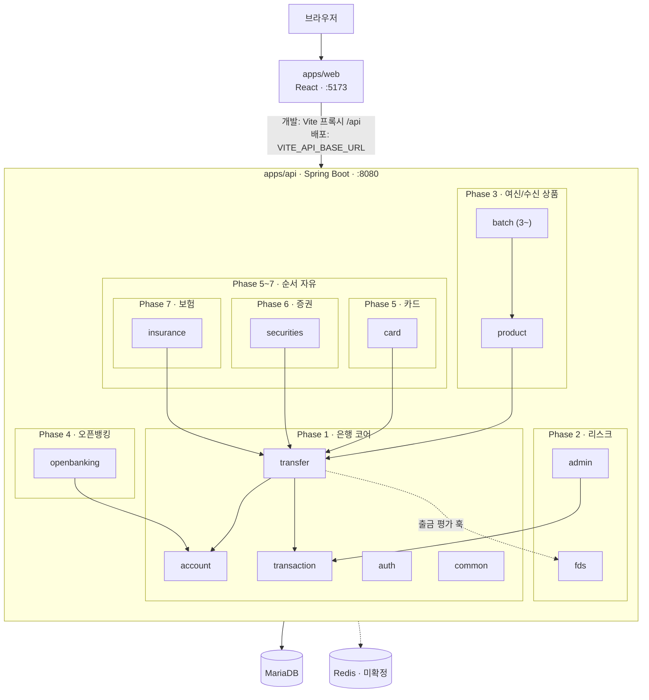

# 03. 기술 스택과 아키텍처

> 무엇을 쓰고 어떻게 배치되는지. 코드 규칙은 [conventions/](conventions/backend.md), 도메인 규칙은 [04-domain.md](04-domain.md)에 있다.

## 한눈에 보기

| 영역     | 선택                                                | 비고                                         |
|--------|---------------------------------------------------|--------------------------------------------|
| 백엔드    | **Spring Boot 3.5.x (LTS)** · Java 21             | 아래 "버전 결정" 참고                              |
| 보안     | Spring Security 6 · JWT (HS256)                   | 정책은 [06-conventions.md](06-conventions.md) |
| 데이터    | Spring Data JPA (Hibernate) · **MariaDB 11.4**    |                                            |
| 캐시/토큰  | Redis (Refresh Token 저장소)                         | **미확정** — 인증 설계 때 결정                       |
| 배치     | Spring Batch                                      | **Phase 3부터** 도입. 자동이체·정산·결제·만기 처리         |
| 프론트엔드  | **React 19 · TypeScript · Vite**                  |                                            |
| 라우팅/상태 | React Router · TanStack Query                     | 전역 상태 라이브러리는 필요해질 때 추가                     |
| 테스트    | JUnit 5 + MockMvc (H2) · Vitest + Testing Library |                                            |
| 코드 품질  | ESLint · Prettier                                 | 백엔드 포매터는 미정 (Spotless 등 검토)                |
| 인프라    | Docker Compose                                    | 로컬: MariaDB(+Redis). 배포: 서버 1대             |
| 빌드     | Gradle 9 (멀티프로젝트) · npm workspaces                | 두 빌드는 결합하지 않는다                             |

## 모노레포 구조

```
bank-bank/
├── apps/
│   ├── api/          # Spring Boot — 계좌·송금과 확장 도메인. 돈을 다루는 쪽
│   └── web/          # React — 고객 화면 + 관리자 화면
├── packages/         # 앱 사이 공유 코드 (아직 비어 있음)
├── docs/             # 이 문서들
├── build.gradle      # 플러그인 버전만 선언
├── settings.gradle   # include 'apps:api'
├── package.json      # npm workspaces
└── docker-compose.yml
```

JVM 모듈은 Gradle이, 프론트엔드는 npm workspaces가 관리한다.

## 아키텍처



확장 도메인 넷(product·card·securities·insurance)이 전부 `transfer` 하나로 모인다. 돈이 움직이는 길은 이것뿐이다.

| 패키지        | 역할                              | Phase |
|---------------|-----------------------------------|-------|
| `auth`        | 회원·JWT                          | [1](domains/01-core.md) |
| `account`     | 계좌·잔액                         | [1](domains/01-core.md) |
| `transfer`    | 송금 — 트랜잭션·락·출금 평가 훅   | [1](domains/01-core.md) |
| `transaction` | 거래내역                          | [1](domains/01-core.md) |
| `common`      | 예외·에러 응답·설정               | [1](domains/01-core.md) |
| `fds`         | 규칙 평가 (출금 평가 훅의 구현체) | [2](domains/02-risk.md) |
| `admin`       | 관리자 조회                       | [2](domains/02-risk.md) |
| `product`     | 예금·대출 상품                    | [3](domains/03-product.md) |
| `batch`       | Spring Batch Job                  | [3~](domains/03-product.md) |
| `openbanking` | OAuth 인가 서버·오픈 API          | [4](domains/04-openbanking.md) |
| `card`        | 승인·매입·정산                    | [5](domains/05-card.md) |
| `securities`  | 주문·체결·T+2                     | [6](domains/06-securities.md) |
| `insurance`   | 청약·납입·만기                    | [7](domains/07-insurance.md) |

## 포트와 환경

| 서비스     | 개발 포트    | 환경 변수                                                                          |
|---------|----------|--------------------------------------------------------------------------------|
| web     | 5173     | `VITE_API_BASE_URL`, `VITE_API_PROXY_TARGET`                                   |
| api     | 8080     | `DB_URL`, `DB_USERNAME`, `DB_PASSWORD`, `CORS_ALLOWED_ORIGINS`, `JPA_DDL_AUTO` |
| MariaDB | **3308** | 호스트 3306·3307이 다른 서비스와 겹쳐서 3308                                                |
| Redis   | 6379     | 도입 확정 시                                                                        |

프론트와 API는 따로 배포한다. 개발 중에는 Vite 프록시(`/api` → `:8080`)를 타고, 배포 시에는 `VITE_API_BASE_URL`과 `CORS_ALLOWED_ORIGINS`를 서로 맞춘다.
