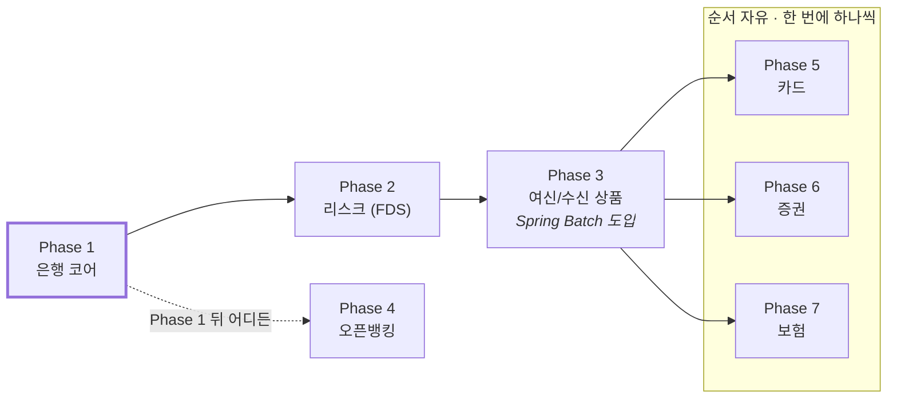

# 05. 진행 순서

> Phase의 순서와 원칙, 전체 시연 시나리오, 리스크만 다룬다. 각 Phase 안의 Step과 완료 조건은 [`domains/`](domains/) 아래 도메인 문서에 있다. 날짜는 팀 회의에서 정해 GitHub 마일스톤에 붙인다.

## Phase 진행

| Phase | 도메인         | 진입 조건    | 완료 조건 (요약)                                                              | 문서                                                   |
| ----- | -------------- | ------------ | ----------------------------------------------------------------------------- | ------------------------------------------------------ |
| 1     | 은행 코어      | —            | 배포 주소에서 가입 → 로그인 → 송금 → 거래내역. 동시성·롤백·멱등성 테스트 통과 | [domains/01-core.md](domains/01-core.md)               |
| 2     | 리스크 (FDS)   | Phase 1 완료 | 고액 송금이 보류되고 추가 인증 후 완료된다. 차단 건이 관리자 화면에 뜬다      | [domains/02-risk.md](domains/02-risk.md)               |
| 3     | 여신/수신 상품 | Phase 2 완료 | 적금 자동 납입 배치가 돌고, 만기 시 이자 포함 지급이 거래내역에 남는다        | [domains/03-product.md](domains/03-product.md)         |
| 4     | 오픈뱅킹       | Phase 1 완료 | 가상 외부 앱이 OAuth로 동의를 받아 계좌를 조회하고 이체한다                   | [domains/04-openbanking.md](domains/04-openbanking.md) |
| 5     | 카드           | Phase 3 완료 | 결제 승인이 계좌 잔액을 줄이고, 일마감 배치가 가맹점별 정산액을 만든다        | [domains/05-card.md](domains/05-card.md)               |
| 6     | 증권           | Phase 3 완료 | 매수 체결 2영업일 뒤 결제 배치가 돌고, 평가액이 갱신된다                      | [domains/06-securities.md](domains/06-securities.md)   |
| 7     | 보험           | Phase 3 완료 | 보험료 미납 시 실효 배치가 돌고, 부활 시 미납분이 정산된다                    | [domains/07-insurance.md](domains/07-insurance.md)     |
