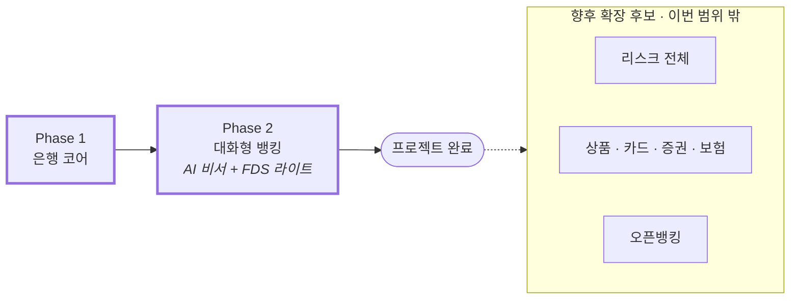

# 05. 진행 순서

> Phase의 순서와 진입·완료 조건만 다룬다. 각 Phase 안의 Step과 시연 장면은 [`domains/`](domains/) 아래 도메인 문서에 있다. 날짜는 팀 회의에서 정해 GitHub 마일스톤에 붙인다.

## Phase 진행

| Phase | 도메인      | 진입 조건    | 완료 조건 (요약)                                                                                                                                                         | 문서                                               |
| ----- | ----------- | ------------ | ------------------------------------------------------------------------------------------------------------------------------------------------------------------------ | -------------------------------------------------- |
| 1     | 은행 코어   | —            | 배포 주소에서 가입 → 로그인 → 이체 → 거래내역. 동시성·롤백·멱등성 테스트 통과                                                                                            | [domains/01-core.md](domains/01-core.md)           |
| 2     | 대화형 뱅킹 | Phase 1 완료 | "엄마한테 5만원"으로 확인 화면이 채워지고 사람이 실행한다. 잔액·거래내역 질의가 화면과 같은 숫자를 답한다. 고액 이체가 보류 → 설명 → 인증 → 완료로 흐른다. 평가 세트 90% | [domains/02-assistant.md](domains/02-assistant.md) |

## Step 한눈에

| Phase · Step        | 완료 조건                                                       |
| ------------------- | --------------------------------------------------------------- |
| 1-1 기반 구축       | 팀원 전원이 배포 주소에서 가입 → 로그인 → 계좌 목록             |
| 1-2 송금과 거래내역 | 서로 송금 → 양쪽 거래내역. 동시성·롤백·멱등성 테스트 통과       |
| 1-3 안정화          | Phase 1 AC 전부, 시연 장면 완주                                 |
| 2-1 도구와 초안     | 말로 만든 초안이 확인 화면에 채워진다. 실행 API 403 테스트 통과 |
| 2-2 조회·설명·보류  | 질문에 답하고, 고액 이체가 보류 → 설명 → 인증 → 완료            |
| 2-3 안정화          | 평가 세트 90%, 주입 케이스 통과, 시연 장면 완주                 |

## 리스크

| 리스크                            | 대응                                                                                 |
| --------------------------------- | ------------------------------------------------------------------------------------ |
| Phase 1이 늦어져 Phase 2가 짧아짐 | Step 1-1을 첫 주에 끝낸다. Phase 2의 P2(음성 출력·이력 복원·대화 조회)를 먼저 버린다 |
| 모델 오인식                       | 되읽기 · 확인 화면 · 이체 비밀번호가 막는다. 평가 세트로 정확도를 관리한다           |
| API 비용                          | 일일 상한(POL-055)과 프롬프트 캐싱. 테스트는 목킹                                    |
| 프롬프트 주입                     | 실행 도구 없음 + 스코프 토큰. 주입 케이스 10개를 CI 앞에서 돌린다                    |
| AI 서비스 장애                    | 은행 기능과 분리. 패널만 "잠시 이용 불가"                                            |
