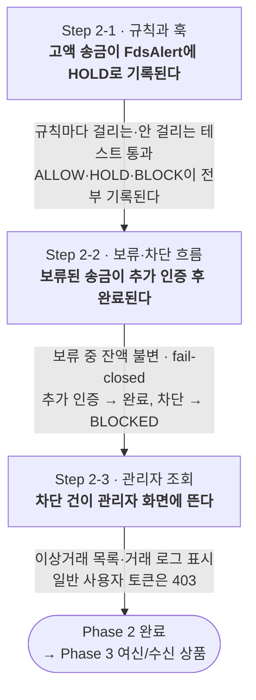

# Phase 2 — 리스크 (FDS)

계좌에서 나가는 모든 거래를 감시한다. 코어의 출금 평가 훅에 규칙을 꽂고, 걸린 거래를 보류하거나 차단하고, 관리자가 그 결과를 본다.

- 진입 조건: [Phase 1](01-core.md) 완료.
- 코어와의 연결점: [출금 평가 훅](../04-domain.md#이후-phase를-위해-코어가-열어둘-자리). 평가 대상이 "이체"가 아니라 "출금 요청"이라 Phase 5~7의 카드·증권·보험 출금도 같은 규칙을 탄다.
- 배치: 없음. 야간 분석 배치는 Phase 3에서 배치 인프라가 들어온 뒤 선택.

## 범위

**실시간 룰**만 구현한다. 규칙 3~4개, 보류·차단 흐름, 관리자 읽기 화면.

향후 후보: ML/DL 모델 학습(룰 기반 `FdsAlert`가 쌓여 레이블 데이터가 생기면), 야간 분석 배치, AML(자금세탁 방지 보고).

## 기능 명세

### FDS — 규칙 평가

초기 규칙(안). 임계값은 설정으로 뺀다.

| 규칙             | 조건                         | 결과 |
| ---------------- | ---------------------------- | ---- |
| 고액 이체        | 1회 금액 ≥ N원               | 보류 |
| 단시간 반복      | 최근 M분 내 이체 K건 이상    | 보류 |
| 신규 수취인 고액 | 처음 보내는 계좌에 N'원 이상 | 보류 |
| 한도 초과        | 1일 누적 이체 ≥ 일한도       | 차단 |

- **보류**: 이체를 실행하지 않고 `PENDING_AUTH`로 두고, 사용자에게 추가 인증(예: 비밀번호 재입력)을 요구한다. 통과 시 실행.
- **차단**: 이체를 `BLOCKED`로 거절하고 관리자 목록에 남긴다.
- 모든 판정은 `FdsAlert`에 기록한다 — 규칙, 점수, 결과, 시각. 정상(`ALLOW`)도 기록한다. 나중에 오탐/미탐 비율을 볼 수 있어야 한다.
- 규칙은 엔티티가 아니라 코드(전략 패턴)다.

**AC**

- [ ] 각 규칙에 대해 걸리는 케이스와 안 걸리는 케이스 테스트가 있다.
- [ ] 보류된 이체는 추가 인증 통과 전까지 잔액이 변하지 않는다.
- [ ] FDS 평가 자체가 실패(예외)해도 송금이 임의로 실행되지 않는다. (fail-closed)

### ADMIN — 관리자 조회

관리자 권한(`ROLE_ADMIN`) 계정만 접근하는 **읽기 전용** 화면.

- 이상거래 목록: 시각, 회원, 금액, 걸린 규칙, 결과. 상세 보기.
- 거래 로그: 전체 거래를 최신순으로. 검색은 계좌번호·기간 정도.

**AC**

- [ ] 일반 사용자 토큰으로 관리자 API 호출 시 403.

## 도메인 모델

### FdsAlert (이상거래 판정)

| 필드      | 타입     | 비고                                 |
| --------- | -------- | ------------------------------------ |
| id        | Long     |                                      |
| transfer  | Transfer |                                      |
| ruleName  | String   | 걸린 규칙. 여러 개면 가장 심각한 것  |
| score     | int      | 규칙별 점수 합. 임계값과 비교        |
| decision  | enum     | `ALLOW`, `HOLD`(보류), `BLOCK`(차단) |
| detail    | String   | 판정 근거                            |
| createdAt | DateTime |                                      |

`Transfer 1 ──── 0..1 FdsAlert`. Transfer의 `PENDING_AUTH`·`BLOCKED` 상태는 [코어 문서](01-core.md#transfer-이체)에 정의되어 있다.

## 시드 데이터

- FDS 시연을 위해 고액 임계값보다 큰 잔액을 가진 계좌 하나.

## 진행

세 Step을 순서대로 간다. 화살표 위가 그 Step의 완료 조건이다.

### Step 2-1 — 규칙과 훅

목표: **고액 송금이 `FdsAlert`에 `HOLD`로 기록된다.** 아직 실제로 막지는 않아도 된다.

| 영역   | 할 일                                                                 |
| ------ | --------------------------------------------------------------------- |
| 백엔드 | 출금 평가 훅의 FDS 구현체, 규칙 3~4개(임계값은 설정), `FdsAlert` 기록 |

**완료 조건**: 규칙마다 걸리는 케이스·안 걸리는 케이스 테스트가 통과한다. `ALLOW`·`HOLD`·`BLOCK`이 전부 기록된다.

### Step 2-2 — 보류·차단 흐름

목표: **보류된 송금이 추가 인증 후 완료된다.**

| 영역   | 할 일                                                                  |
| ------ | ---------------------------------------------------------------------- |
| 백엔드 | 보류(`PENDING_AUTH`) → 추가 인증 API → 완료 흐름. 차단(`BLOCKED`) 처리 |
| 프론트 | 송금 결과에 보류·차단 케이스 추가, 추가 인증 화면                      |

**완료 조건**: 보류 중 잔액이 변하지 않는다. FDS 평가가 실패해도 송금이 실행되지 않는다(fail-closed). 고액 송금이 보류 → 추가 인증 → 완료로 흐른다.

### Step 2-3 — 관리자 조회

목표: **차단 건이 관리자 화면에 뜬다.**

| 영역   | 할 일                                                         |
| ------ | ------------------------------------------------------------- |
| 백엔드 | 관리자 API — 이상거래 목록·상세, 거래 로그. `ROLE_ADMIN` 인가 |
| 프론트 | 관리자 화면 — 이상거래 목록, 거래 로그 (읽기 전용)            |

**완료 조건**: 이상거래 목록과 거래 로그가 보인다. 일반 사용자 토큰으로 관리자 API 호출 시 403. [기능 명세](#기능-명세)의 AC 전부 체크.

## 시연 장면

[Phase 1 시연 장면](01-core.md#시연-장면)에 이어서 돌린다.

1. 고액 송금 → FDS 보류 → 추가 인증 → 완료
2. 단시간 반복 송금 → 차단
3. 관리자 로그인 → 이상거래 목록에서 1·2번 확인 → 거래 로그
