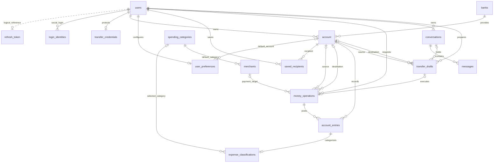

# talking-bank ERD 초안

> 기준: 팀장님 ERD 스크린샷과 [MVP](./mvp.md). PR 원문 전체는 아직 확인하지 않았다. PRD가 아직 작성되지 않아 아래 테이블·컬럼·제약은 팀 검토용 설계 제안이다. DB 마이그레이션이나 구현을 확정하는 문서가 아니다.

## 기존안과 이번 확장안의 구분

| 구분 | 반영 내용 |
| --- | --- |
| 기존 유지 | users의 컬럼명·상태, refresh_token의 사용자당 한 행 및 FK 없는 논리 참조, account의 단수 이름·기존 컬럼·전역 계좌번호 UNIQUE·DECIMAL(19,2) |
| 기존 변경 제안 | users의 이메일·비밀번호 NULL 허용, 사용자 유형·관리자 권한 추가, account의 소유자·은행 FK 추가 |
| 신규 제안 | 소셜 로그인 연결, 송금 PIN, 은행, 별명·기본 계좌, 금융 작업·입출금, 소비 분류, 대화·송금 초안 |
| 확인 한계 | 스크린샷에서 확인한 범위만 반영. 로컬에는 Account가 있으며 User·RefreshToken 구현은 확인되지 않음 |

기존 구조의 유지와 변경 제안을 구분해 검토한다. 팀장님 PR 원문에 추가 규칙이 있으면 이 초안을 다시 대조한다.

## 1. 설계 범위와 공통 규칙

- 기존 `users`의 이메일·비밀번호 인증을 유지하고 소셜 로그인 연결 테이블을 추가하여 같은 계정에 접근한다.
- 가입자와 시연용 가상 인물은 동일한 계좌 소유자 구조를 사용하되, 가상 인물은 로그인하지 못한다.
- 은행·계좌·송금·결제·충전은 모두 프로젝트 내부의 가상 데이터다.
- 금융상품, 패스키, 생체 인증, 실제 금융기관 연동은 포함하지 않는다.
- PK는 `BIGINT`, 금액은 `DECIMAL(19,2)` 및 Java `BigDecimal`을 제안한다. 기존 계좌 금액 자료형을 유지한다. MVP는 `KRW`만 허용하고 입력 금액은 원 단위 정수로 검증한다. USD·환전은 포함하지 않는다.
- 모든 테이블에 `id`, `created_at`, `updated_at`을 둔다. 시간 필드는 `BaseTimeEntity`와 JPA Auditing으로 관리하며 DB 기본값이나 `@PrePersist`를 사용하지 않는다.
- 업무 발생 시각인 `occurred_at`은 생성 시각과 구분한다. 샘플 거래는 과거 발생 시각을 가질 수 있다. 시각은 UTC로 저장하고 소비 기간은 한국 시간 기준으로 계산하는 방안을 제안한다.
- 아래 표의 `?`는 NULL 허용이다. 나머지는 NOT NULL이다. 문자열 길이와 DB별 자료형은 물리 설계 때 확정한다.
- 금융 기록이 연결된 사용자·계좌·가맹점·카테고리는 삭제를 제한한다. 상태 전환을 사용하고 금융 기록에 연쇄 삭제를 적용하지 않는다.

## 2. 관계도

금융 작업 한 건(`money_operations`)과 계좌별 입출금 기록(`account_entries`)을 구분한다. 완료된 송금은 작업 한 건과 출금·입금 기록 두 건으로 표현한다. 관계도의 0개 이상 기록은 실행 중·실패 상태도 표현하기 위한 것이며, 완료 상태별 기록 개수는 5절에서 제한한다.

## 3. 사용자·인증·계좌

### users — 기존 사용자 구조 확장

| 컬럼 | 자료형 | 의미 / 제약 |
| --- | --- | --- |
| email ? | VARCHAR(255) | UNIQUE, trim·소문자 정규화. 이메일 로그인 식별자 |
| password ? | VARCHAR(255) | BCrypt 해시 |
| name | VARCHAR(50) | 기존 이름 컬럼 유지 |
| phone ? | VARCHAR(20) | 기존 컬럼 유지, 필수 수집 여부 미정 |
| status | ENUM | 기존 `ACTIVE`, `LOCKED`, `WITHDRAWN` 유지 |
| login_fail_count | INT | 연속 로그인 실패 횟수, 0 이상 |
| last_login_at ? | TIMESTAMP | 마지막 로그인 시각 |
| locked_until ? | TIMESTAMP | 잠금 해제 시각 |
| user_type | ENUM | 추가 제안: `REGISTERED`, `DEMO` |
| role | ENUM | 추가 제안: `USER`, `ADMIN` |

기존 이메일·비밀번호 컬럼을 로그인 테이블로 옮기지 않는다. 소셜 전용 사용자와 가상 인물을 위해 email·password의 NULL 허용을 **변경 제안**한다. 이메일 로그인을 등록할 때는 두 값을 모두 설정하고 이메일 소유 확인을 거친다. 소셜 공급자가 제공한 이메일은 자동으로 이 컬럼에 연결하지 않는다. NULL 이메일의 UNIQUE 처리 방식은 선정 DB에서 확인한다.

`DEMO`는 시연용 계좌 소유자이며 이메일·비밀번호·소셜 로그인 수단을 갖지 않고 로그인할 수 없다. 관리자는 role로 구분하며 가상 인물에게 ADMIN 권한을 부여하지 않는다. status가 LOCKED 또는 WITHDRAWN이면 로그인 수단에 관계없이 접근을 제한한다.

### refresh_token — 기존 세션 갱신 구조

| 컬럼 | 자료형 | 의미 / 제약 |
| --- | --- | --- |
| user_id | BIGINT | UNIQUE, users.id 논리 참조. 기존안에는 물리 FK 없음 |
| token | VARCHAR(512) | 기존 토큰 저장 컬럼 |
| expires_at | TIMESTAMP | 만료 시각 |

사용자당 최대 한 행인 기존 구조를 유지한다. 관계도의 점선은 논리 참조이며 FK 추가를 뜻하지 않는다. 소셜 로그인도 같은 사용자 세션 정책을 사용한다. 사용자 탈퇴·차단 시 토큰 정리와 사용자 존재 검증은 서비스에서 수행한다. 회전·폐기·다중 기기 로그인 정책과 token의 원문/해시 저장 여부는 인증 PR 원문 확인 후 결정한다. 토큰은 로그나 일반 사용자 조회 응답에 포함하지 않는다.

### login_identities — 소셜 로그인 연결 추가 제안

| 컬럼 | 의미 / 제약 |
| --- | --- |
| user_id | FK → users |
| provider | `KAKAO`, `GOOGLE` |
| subject | 공급자의 고유 사용자 식별자 |

- UNIQUE `(provider, subject)`: 하나의 소셜 계정이 서로 다른 사용자에게 연결되지 않는다.
- UNIQUE `(user_id, provider)`: 공급자별 하나의 계정 연결을 제안한다.
- 이메일 로그인은 기존 users에서 관리하며 이 테이블에 중복 저장하지 않는다.
- 소셜에서 제공한 이메일 주소로 계정을 자동 연결하지 않는다. 기존 로그인과 새 공급자 인증을 모두 확인하고 연결한다.

### transfer_credentials — 송금용 간편 비밀번호

| 컬럼 | 의미 / 제약 |
| --- | --- |
| user_id | FK → users, UNIQUE |
| pin_hash | 6자리 간편 비밀번호의 단방향 해시 |
| failed_attempts | 실패 횟수, 0 이상 |
| locked_until ? | 잠금 만료 시각 |

간편 비밀번호 설정 전에는 행이 없을 수 있으며, 이 상태에서는 송금을 실행하지 않는다. 원문 비밀번호와 PIN은 로그·응답·대화에 저장하지 않는다. 실패 한도와 복구 정책은 PRD에서 결정한다.

### banks — 가상 은행

| 컬럼 | 의미 / 제약 |
| --- | --- |
| code | 내부 은행 코드, UNIQUE |
| name | 농협은행 등 표시 이름 |
| status | `ACTIVE`, `INACTIVE` |

### account — 기존 계좌 구조 확장

| 컬럼 | 자료형 | 의미 / 제약 |
| --- | --- | --- |
| account_number | VARCHAR(30) | 기존 전역 UNIQUE 유지 |
| owner_name | VARCHAR(50) | 기존 소유자명 유지, 개설 시 이름 스냅샷 |
| product_name | VARCHAR(100) | 기존 계좌 표시용 상품명 유지 |
| balance | DECIMAL(19,2) | 기존 자료형 유지, 잔액 0 이상 |
| currency | VARCHAR(3) | 기존 컬럼 유지, MVP에서는 KRW만 허용 |
| status | ENUM | 기존 `ACTIVE`, `DORMANT`, `CLOSED` 유지 |
| opened_at | DATE | 개설일 |
| user_id | BIGINT | 추가 제안: FK → users, 소유자 |
| bank_id | BIGINT | 추가 제안: FK → banks |

`account` 단수 테이블명과 기존 전역 계좌번호 고유 제약을 유지한다. 은행별 복합 UNIQUE로 변경하지 않는다. 이름 문자열이 아닌 user_id로 본인 계좌와 권한을 판단한다. 사용자당 여러 은행 계좌를 허용하며, 거래 생성 이후 소유자를 변경하지 않는다. product_name 유지는 금융상품 가입 기능을 MVP에 추가한다는 뜻이 아니다.

기존 계좌에는 소유자·은행 FK가 없으므로 실제 마이그레이션 시 데이터 매핑 후 NOT NULL을 적용해야 한다. owner_name만으로 가입자와 자동 연결하지 않는다. 시연 계좌는 명시적으로 가상 인물과 연결한다. `BaseTimeEntity` 상속은 팀장님 문서 기준이며 현재 로컬 Account 코드에는 아직 없어 구현 차이를 후속 작업에서 맞춰야 한다.

### user_preferences — 사용자 설정

| 컬럼 | 의미 / 제약 |
| --- | --- |
| user_id | FK → users, UNIQUE |
| default_account_id ? | FK → account, 기본 출금 계좌 |

기본 출금 계좌는 해당 사용자 소유의 사용 가능한 계좌여야 한다. 다른 사용자 계좌를 지정하지 못하도록 서비스에서 검증한다.

### saved_recipients — 저장한 수취 계좌와 별명

| 컬럼 | 의미 / 제약 |
| --- | --- |
| user_id | FK → users, 등록한 사용자 |
| account_id | FK → account, 수취 계좌 |
| nickname | 엄마·민수 등 사용자 전용 별명 |

UNIQUE `(user_id, account_id)`. 별명은 전역 고유값이 아니다. 중복 별명을 허용하고 챗봇에서 후보를 선택하게 하는 방안을 제안한다. 이름이나 별명이 같다는 이유로 수취 계좌를 임의 확정하지 않는다.

## 4. 금융 작업·소비·대화

### money_operations — 자금 이동 작업

| 컬럼 | 의미 / 제약 |
| --- | --- |
| requested_by | FK → users, 사용자 또는 시연 데이터를 생성한 관리자 |
| type | `TRANSFER`, `PAYMENT`, `TOP_UP`, `INITIAL_FUNDING` |
| source_account_id ? | FK → account, 출금 계좌 |
| destination_account_id ? | FK → account, 입금 계좌 |
| merchant_id ? | FK → merchants, 결제 가맹점 |
| transfer_draft_id ? | FK → transfer_drafts, UNIQUE, 송금 승인 대상 |
| amount | 0보다 큰 금액 |
| status | `PENDING`, `COMPLETED`, `FAILED` |
| idempotency_key | 중복 실행 방지 요청 키 |
| request_fingerprint | 동일 키로 다른 금액·계좌를 요청했는지 확인할 정규화된 요청 지문 |
| data_origin | `USER_ACTION`, `SAMPLE`, `SYSTEM` |
| occurred_at | 업무 발생 시각 |
| completed_at ? | 완료 시각 |
| failure_code ? | 실패 사유 코드. 민감한 원문 저장 금지 |

UNIQUE `(requested_by, idempotency_key)`. 같은 키·같은 요청은 기존 결과를 반환하고, 같은 키·다른 요청은 거절한다.

| 유형 | 필수 대상 | NULL 대상 |
| --- | --- | --- |
| TRANSFER | 출금 계좌, 입금 계좌 | 가맹점 |
| PAYMENT | 출금 계좌, 가맹점 | 입금 계좌, 송금 초안 |
| TOP_UP / INITIAL_FUNDING | 입금 계좌 | 출금 계좌, 가맹점, 송금 초안 |

사용자 송금은 승인된 송금 초안이 필수다. 관리자 샘플 송금은 초안 없이 허용하되 관리자 권한과 `SAMPLE` 출처를 검증한다. 샘플 송금도 양쪽 계좌 기록이 필요하다. 결제는 외부 상점 계좌까지 모델링하지 않고 가맹점을 대상으로 한 출금으로 표현한다.

### account_entries — 계좌별 입출금 기록

| 컬럼 | 의미 / 제약 |
| --- | --- |
| operation_id | FK → money_operations |
| account_id | FK → account |
| direction | `DEBIT`, `CREDIT` |
| amount | 0보다 큰 금액 |
| balance_after | 반영 직후 계좌 잔액, 0 이상 |
| entry_sequence | 계좌별 증가 순번 |

UNIQUE `(operation_id, account_id)`, UNIQUE `(account_id, entry_sequence)`. 금액은 양수로 저장하고 입출금 방향으로 부호를 구분한다. 발생 시각은 작업의 `occurred_at`을 사용한다. 순번은 같은 계좌의 동시 거래 순서와 잔액 검증에 사용한다.

### spending_categories — 소비 카테고리

| 컬럼 | 의미 / 제약 |
| --- | --- |
| code | `FOOD`, `TRANSPORT` 등 내부 코드, UNIQUE |
| name | 식비·교통 등 표시 이름 |
| active | 신규 분류 사용 여부 |

카테고리 목록은 PRD에서 확정한다. 미분류는 별도 카테고리 대신 아래 분류 행의 NULL로 표현한다.

### merchants — 가상 가맹점

| 컬럼 | 의미 / 제약 |
| --- | --- |
| name | 가맹점 이름 |
| industry_code | 프로젝트 내부 업종 코드. 실제 MCC와 동일하다고 가정하지 않음 |
| default_category_id | FK → spending_categories |
| active | 신규 결제 가능 여부 |

### expense_classifications — 소비 대상 및 거래별 분류

| 컬럼 | 의미 / 제약 |
| --- | --- |
| account_entry_id | FK → account_entries, UNIQUE |
| category_id ? | FK → spending_categories, NULL이면 미분류 |
| classification_source | `AUTO`, `MANUAL`, `UNCLASSIFIED` |

분류 행은 결제 출금과 타인 송금 출금에만 생성한다. 본인 이체·충전·입금에는 생성하지 않는다. 이 행의 존재로 소비 포함 여부를 표현하며, NULL 카테고리도 총소비에 합산한다. 소유 사용자가 분류를 수정하면 `MANUAL`로 기록한다. 기본 카테고리는 결제 시 복사하고 가맹점 설정 변경으로 과거 거래를 재분류하지 않는다.

### conversations / messages — 대화

| 테이블 | 컬럼 | 의미 / 제약 |
| --- | --- | --- |
| conversations | user_id | FK → users |
| conversations | title | 대화 제목 |
| messages | conversation_id | FK → conversations |
| messages | role | `USER`, `ASSISTANT` |
| messages | input_type ? | 사용자 입력 `TEXT`, `VOICE`; AI 답변은 NULL |
| messages | content | 사용자 입력 또는 답변 텍스트 |
| messages | sequence | 대화 내 순서 |

UNIQUE `(conversation_id, sequence)`. 음성 원본 저장은 현재 범위에 넣지 않고 STT 결과 텍스트를 저장하는 방안을 제안한다. 차트 등 구조화된 응답 저장 형식과 보존 기간은 PRD에서 결정한다.

### transfer_drafts — 송금 대화와 확인 대상

| 컬럼 | 의미 / 제약 |
| --- | --- |
| user_id | FK → users, 요청자 |
| conversation_id ? | FK → conversations, 일반 화면에서는 NULL |
| source_account_id ? | FK → account |
| destination_account_id ? | FK → account |
| amount ? | 입력된 송금액, 값이 있으면 0보다 큼 |
| status | `COLLECTING`, `READY`, `EXECUTED`, `CANCELLED`, `EXPIRED` |
| revision | 확인 내용 변경 시 증가하는 버전 |
| expires_at | 유효기한 |
| confirmed_at ? | 사용자가 해당 버전 내용을 확인한 시각 |

은행·수취인은 선택된 계좌로부터 조회한다. 정보가 부족한 동안 계좌와 금액은 NULL일 수 있다. 일반 화면도 동일한 확인 절차를 사용한다. AI 대화의 “확인했어요”만으로 실행 권한을 부여하지 않는다.

## 5. 정합성과 실행 규칙

DB의 PK·FK·UNIQUE·금액 CHECK와, 여러 행을 다루는 서비스 트랜잭션 검증을 함께 사용한다.

1. 사용자 송금은 소유 출금 계좌, 사용 가능한 수취 계좌, 서로 다른 계좌, 양수 금액, 잔액, 초안 소유권·버전·유효기한을 검증한다.
2. 확인 화면의 버전과 서버 초안 버전이 같아야 하며 간편 비밀번호를 서버에서 검증한다. 계좌나 금액을 바꾸면 기존 확인을 무효화한다. PIN 검증은 해당 요청에만 유효하며 재사용 가능한 승인 플래그로 저장하지 않는다.
3. 서비스의 `@Transactional` 범위에서 계좌를 일정한 ID 순서로 잠그고 잔액 검증·변경, 금융 기록 생성, 초안 실행 완료를 함께 처리하는 방안을 제안한다.
4. 완료된 송금에는 같은 금액의 출금·입금 기록 두 건, 결제에는 출금 한 건, 충전·초기 자금에는 입금 한 건만 존재해야 한다. 기록의 계좌·방향·금액은 작업 유형과 일치해야 한다.
5. 실패 시 잔액과 기록을 함께 롤백한다. 실패 상태를 남기는 작업이 필요하면 금융 변경 롤백 후 별도 트랜잭션으로 기록한다. 동일 요청의 동시 실행은 요청 키와 초안 잠금·고유 제약으로 막는다.
6. 계좌 잔액은 전체 입금에서 출금을 뺀 금액과 일치해야 한다. 초기 자금도 입금 작업으로 남긴다. 샘플 과거 거래는 계좌 개설 시 시간 순서대로 생성해 마지막 잔액을 100만 원으로 맞춘다. 기존 계좌에 과거 기록을 추가할 때는 잔액·순서를 재검증하며 기존 금융 기록을 단순 덮어쓰지 않는다.
7. 소비 집계는 완료된 작업의 소비 분류 행만 대상으로 하고 출금 계좌 소유자 기준으로 조회한다. 본인 계좌 간 이동은 소유자 ID로 판단한다. 분류 변경은 금융 기록을 변경하지 않는다.
8. 대화 삭제 시 메시지를 삭제하고 송금 초안의 대화 참조는 NULL로 해제한다. 미실행 초안은 취소한다. 완료된 작업·계좌 기록·실행 초안은 유지한다. 금융 작업에서 대화로 이어지는 연쇄 삭제를 금지한다.
9. 가상 충전은 요청자 본인 계좌만 허용한다. 샘플 데이터 생성은 관리자 전용 경로에서 처리한다. 일반 사용자 요청이 `SAMPLE`이나 `SYSTEM` 출처를 지정해 인증을 우회할 수 없어야 한다.

## 6. 주요 조회 인덱스 제안

| 테이블 | 인덱스 | 목적 |
| --- | --- | --- |
| account | `(user_id, status)` | 본인 계좌 조회 |
| account_entries | `(account_id, entry_sequence)` UNIQUE | 거래 순서·잔액 검증 |
| money_operations | `(occurred_at, status)` | 기간별 완료 거래 조회 |
| expense_classifications | `(category_id, account_entry_id)` | 카테고리 집계 |
| conversations | `(user_id, updated_at)` | 사용자 대화 목록 |
| messages | `(conversation_id, sequence)` UNIQUE | 대화 순서 |

고유 제약에 의해 생성되는 인덱스를 중복 생성하지 않는다. 실제 조회 계획에 따라 복합 인덱스를 조정한다.

## 7. PRD·팀 검토에서 확정할 사항

- 기존 refresh_token의 저장 형식·회전·폐기·다중 기기 정책 및 FK 부재 유지 여부
- 이메일 검증·계정 복구·연결 해제 정책과 소셜 가입자의 필수 수집 정보
- 간편 비밀번호 실패 횟수·잠금·재설정 정책
- 송금 초안 만료 시간, 이체·충전 한도, 수수료 정책
- 별명 중복 정책과 기본 출금 계좌 미설정 시 처리
- 소비 카테고리 목록과 비교 기간·이전 기간 소비가 0일 때 증감률 표시
- 샘플 거래 기간·생성량 및 기존 계좌에 샘플 추가 시점 정책
- 메시지의 구조화 응답 형식, 대화 보존·삭제 정책
- DB 제품·문자열 길이·상태 코드·잠금 방식과 개인정보 보존 정책

이 문서는 MVP 요구사항에 대한 설계 초안이다. 위 미정 사항과 PRD가 확정되면 컬럼·제약을 갱신한 뒤 마이그레이션과 엔티티를 구현한다.
