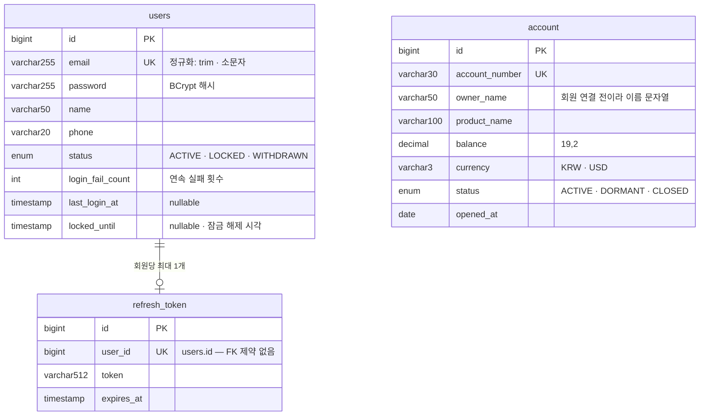

# ERD

스키마의 주인은 엔티티다. 바꿀 때는 아래 파일을 고치고 이 그림을 따라 고친다.

| 표                                    | 엔티티                                                                                                | enum                                                                                                 |
| ------------------------------------- | ----------------------------------------------------------------------------------------------------- | ---------------------------------------------------------------------------------------------------- |
| `users`                               | [User](../apps/api/src/main/java/com/example/talkingbank/user/entity/User.java)                       | [UserStatus](../apps/api/src/main/java/com/example/talkingbank/user/entity/UserStatus.java)          |
| `refresh_token`                       | [RefreshToken](../apps/api/src/main/java/com/example/talkingbank/auth/entity/RefreshToken.java)       |                                                                                                      |
| `account`                             | [Account](../apps/api/src/main/java/com/example/talkingbank/account/entity/Account.java)              | [AccountStatus](../apps/api/src/main/java/com/example/talkingbank/account/entity/AccountStatus.java) |
| 모든 표의 `created_at` · `updated_at` | [BaseTimeEntity](../apps/api/src/main/java/com/example/talkingbank/common/entity/BaseTimeEntity.java) |                                                                                                      |
