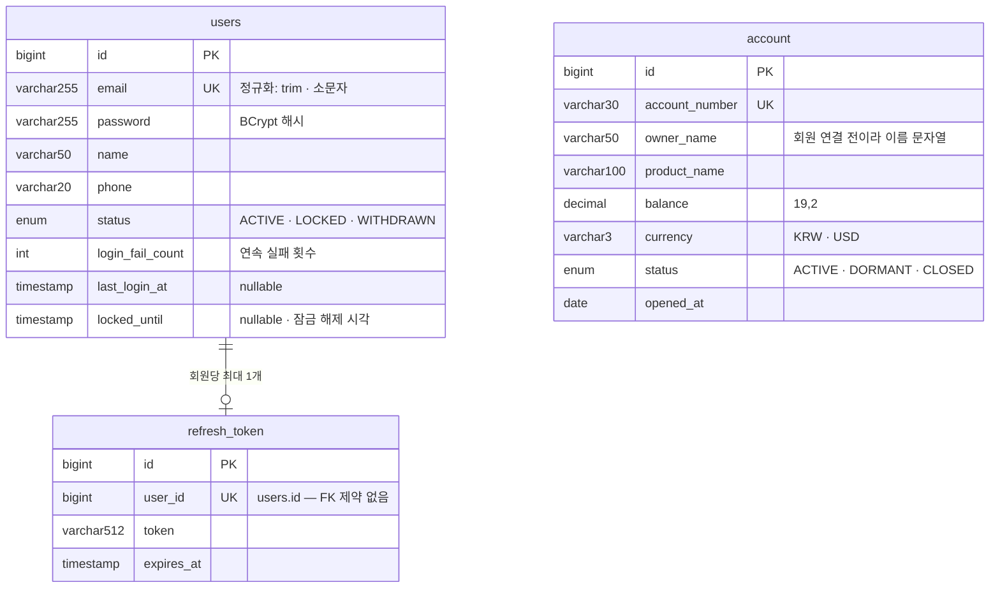

# ERD

현재 스키마는 표 **3개**다. 회원(`users`), Refresh Token(`refresh_token`), 계좌(`account`).

**스키마의 주인은 코드다.** 표는 JPA 엔티티(`apps/api/.../entity/`)에서 Hibernate가 만든다. 이 문서는 그 결과를 사람이 읽기 위한 것이므로, 스키마를 바꿀 때는 엔티티를 먼저 고치고 이 문서를 따라 고친다. 아래 내용은 로컬 H2에 실제로 생성된 스키마를 덤프해 맞췄다.

## 한눈에 보기

모든 표에 `created_at`과 `updated_at`이 있다(`NOT NULL`). `BaseTimeEntity`를 상속해 JPA Auditing이 채운다. 다이어그램에서는 줄이려고 뺐다.

`account`는 아직 어떤 표와도 연결되어 있지 않다. 회원-계좌 연결은 아래 [앞으로](#앞으로)를 참고한다.

## 표별 명세

### users — 회원

| 컬럼               | 타입         | 제약               | 설명                                                       |
| ------------------ | ------------ | ------------------ | ---------------------------------------------------------- |
| `id`               | BIGINT       | PK, auto increment |                                                            |
| `email`            | VARCHAR(255) | NOT NULL, UNIQUE   | 저장 전 `trim` + 소문자. 중복 확인과 가입이 같은 값을 본다 |
| `password`         | VARCHAR(255) | NOT NULL           | BCrypt 해시. 평문은 어디에도 남기지 않는다                 |
| `name`             | VARCHAR(50)  | NOT NULL           |                                                            |
| `phone`            | VARCHAR(20)  | NOT NULL           | `010-0000-0000`                                            |
| `status`           | ENUM         | NOT NULL           | `ACTIVE` · `LOCKED`(관리자 잠금) · `WITHDRAWN`             |
| `login_fail_count` | INT          | NOT NULL           | 연속 실패 횟수. 잠기거나 성공하면 0으로 돌아간다           |
| `last_login_at`    | TIMESTAMP    | nullable           | 마지막 로그인 성공 시각                                    |
| `locked_until`     | TIMESTAMP    | nullable           | 실패 누적 잠금이 풀리는 시각. `null`이면 잠기지 않았다     |

잠김 판정은 두 가지를 OR로 본다. `status`가 `LOCKED`인 경우(영구, 관리자용)와 `locked_until`이 현재보다 미래인 경우(실패 누적, 기본 30분)다.

### refresh_token — Refresh Token

| 컬럼         | 타입         | 제약               | 설명                                       |
| ------------ | ------------ | ------------------ | ------------------------------------------ |
| `id`         | BIGINT       | PK, auto increment |                                            |
| `user_id`    | BIGINT       | NOT NULL, UNIQUE   | `users.id`를 가리킨다. **FK 제약은 없다**  |
| `token`      | VARCHAR(512) | NOT NULL           | JWT 문자열                                 |
| `expires_at` | TIMESTAMP    | NOT NULL           | 기본 7일. 재발급할 때 토큰과 함께 갱신된다 |

`user_id`가 UNIQUE라 **회원당 행 하나**다. 재발급하면 새 행을 만들지 않고 이 행의 `token`과 `expires_at`을 바꾼다(rotation). 로그아웃하거나 이미 교체된 옛 토큰이 다시 오면(탈취 의심) 행을 지운다.

### account — 계좌

| 컬럼             | 타입          | 제약               | 설명                                        |
| ---------------- | ------------- | ------------------ | ------------------------------------------- |
| `id`             | BIGINT        | PK, auto increment |                                             |
| `account_number` | VARCHAR(30)   | NOT NULL, UNIQUE   | `110-123-456789`                            |
| `owner_name`     | VARCHAR(50)   | NOT NULL           | 회원 연결 전이라 이름을 문자열로 들고 있다  |
| `product_name`   | VARCHAR(100)  | NOT NULL           | 상품명                                      |
| `balance`        | DECIMAL(19,2) | NOT NULL           | `BigDecimal`. `double` 금지                 |
| `currency`       | VARCHAR(3)    | NOT NULL           | `KRW` · `USD`                               |
| `status`         | ENUM          | NOT NULL           | `ACTIVE` · `DORMANT`(휴면) · `CLOSED`(해지) |
| `opened_at`      | DATE          | NOT NULL           | 개설일                                      |

## 알아둘 점

- **FK 제약이 하나도 없다.** `refresh_token.user_id`는 값으로만 회원을 가리킨다. 엔티티가 연관 관계(`@ManyToOne`) 대신 `Long userId`를 들고 있어서다. 도메인 사이를 Service로만 잇는 구조라 의도한 것이지만, 회원을 지우면 토큰 행이 남는다. 회원 삭제 기능을 만들 때 함께 지우는 처리가 필요하다.
- **`status`가 native ENUM 타입으로 생성된다.** 엔티티에 `@Enumerated(STRING)`과 길이 20을 적었는데, Hibernate 6이 DB의 enum 타입을 쓰면서 길이 지정이 무시된다. 값을 추가할 때 `ALTER TABLE`이 필요하다. `VARCHAR(20)`으로 고정하고 싶으면 `@JdbcTypeCode(SqlTypes.VARCHAR)`를 붙인다.
- **시각은 `LocalDateTime`이고 JVM 시간대를 따른다.** `TimeZoneConfig`가 Asia/Seoul로 고정한다. 오프셋을 저장하지 않으므로 DB를 직접 볼 때도 KST로 읽는다.
- **로컬 DB는 인메모리 H2다.** 서버를 내리면 데이터가 사라지고, 스키마는 `ddl-auto: update`로 매번 만들어진다. 운영은 `validate`라서 스키마를 사람이 적용해야 한다.

## 앞으로

확정된 계획이 아니라 지금 열려 있는 자리다. 실제 컬럼은 해당 작업에서 정한다.

| 언제           | 무엇                                                                                   |
| -------------- | -------------------------------------------------------------------------------------- |
| 계좌-회원 연결 | `account`에 `user_id` 추가. `owner_name` 문자열은 `users.name`으로 대체된다            |
| 이체           | `transfer`(이체 요청)와 `transaction`(계좌별 입출금 기록) 추가. 금액은 `DECIMAL(19,2)` |
| AI 비서        | 수취인 별칭, 대화 · 메시지 기록                                                        |
