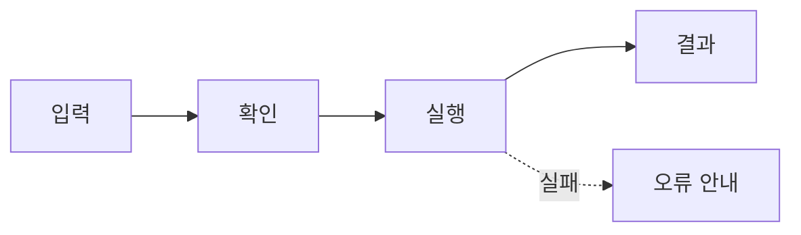

# PRD · <기능명> (<작업 ID 도메인>)

<!--
기능 하나를 착수하기 직전에, 그 기능만 쓴다. 한 화면 분량을 넘기지 않는다.
파일은 docs/domains/<phase>/<도메인 ID>.md 에 두고, 도메인 문서의 기능 명세는 이 파일을 링크한다.
이 파일 하나를 AI에 주고 "이 PRD 기준으로 산정·이슈 생성·구현"이 되는 것이 목표다.
<!-- --> 주석은 채운 뒤 지운다.

-->

| Owner    | Version | Status | Phase · Step           |
| -------- | ------- | ------ | ---------------------- |
| <담당자> | v0.1    | Draft  | Phase <N> · Step <N-M> |

<!-- Status: Draft → Review → Approved. 날짜는 적지 않는다 — 이슈 마일스톤으로 관리 -->

## 1. 개요

<!-- 무엇을 만드는지 한 문단. 기존에 무엇이 있고 거기에 무엇을 더하는지 -->

### 1.1 왜 필요한가

<!-- 2~3줄. 이 기능이 없으면 무엇이 안 되는지. 운영 수치가 있으면 적고, 없으면 만들지 않는다 -->

-
-

### 1.2 완료 기준

<!-- 누가 봐도 확인 가능한 것만. "구현한다"가 아니라 "~하면 ~된다" -->

- [ ]
- [ ]
- [ ]

<!-- 숫자로 잴 수 있는 기준이 있으면 표로 -->

| 항목 | 기준 |
| ---- | ---- |
|      |      |

## 2. 범위

### 2.1 이번에 하는 것

-
-

### 2.2 향후 후보

<!-- 지금 하지 않는 것과 다시 볼 조건 -->

| 항목 | 다시 볼 조건 |
| ---- | ------------ |
|      |              |

## 3. 사용자 흐름

<!-- 화면 순서. 프론트와 백엔드가 같은 그림을 보는 곳. 분기(실패·거절)도 그린다 -->

## 4. 기능 요구사항

<!-- 동작 규칙. 한 줄에 하나. 공통 규칙(04-domain.md)과 겹치면 링크만 -->

-
-

## 5. API

<!-- 06-conventions.md의 API 계약 형식을 따른다. 응답 포맷·에러 포맷은 거기 정의된 것을 쓴다 -->

| Method | URL | 요청 | 응답 | 에러 코드 |
| ------ | --- | ---- | ---- | --------- |
|        |     |      |      |           |

## 6. 데이터

<!-- 건드리는 엔티티·컬럼, 상태 전이. 정의는 ERD 문서에 두고 여기서는 무엇을 쓰는지만 -->

- 엔티티:
- 새 컬럼 / 상태:
- ERD: <!-- 링크 -->

## 7. 진행

<!-- 이 기능을 이루는 작업. 각 행이 이슈 하나가 된다. 하루 안에 끝나는 크기로 -->

| 작업 ID | 영역   | 할 일 | 완료 조건 |
| ------- | ------ | ----- | --------- |
| <ID>-01 | 백엔드 |       |           |
| <ID>-02 | 프론트 |       |           |
