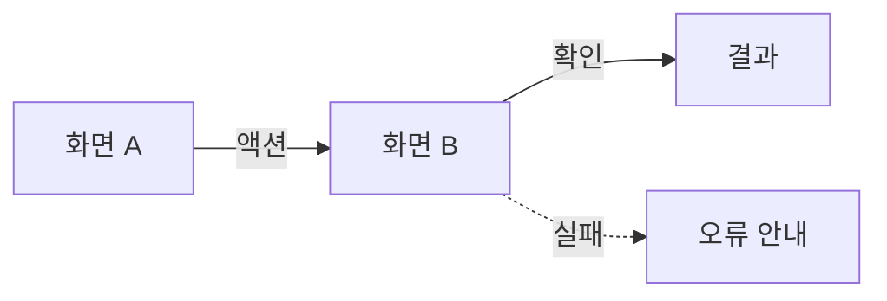

# UI 브리프 · <Phase 또는 기능명>

<!--
Figma AI(Make · First Draft · Claude + Figma MCP)에 화면을 맡기기 전에 채우는 문서다.
AI는 "어떤 화면"은 잘 그리지만 "어떤 데이터가 · 어떤 상태로 · 어떤 규칙으로" 보이는지는 지어낸다.
그 사실들을 여기에 모은다. 이 파일을 통째로 프롬프트에 붙일 수 있는 분량(한두 화면 스크롤)을 넘기지 않는다.
<!-- --> 주석은 채운 뒤 지운다.

-->

| Owner    | Version | Status | Phase     | 관련 PRD |
| -------- | ------- | ------ | --------- | -------- |
| <담당자> | v0.1    | Draft  | Phase <N> | <링크>   |

## 1. 대상

| 항목        | 값                                               |
| ----------- | ------------------------------------------------ |
| 역할        | <!-- 고객 / 관리자 -->                           |
| 플랫폼      | <!-- 데스크톱 웹 / 모바일 웹 / 둘 다(반응형) --> |
| 기준 뷰포트 | <!-- 예: 1280 × 800, 390 × 844 -->               |
| 화면 수     | <!-- 이 브리프가 다루는 화면 개수 -->            |

## 2. 톤과 디자인 토큰

<!-- 디자인 시스템이 확정되어 있으면 링크만. 없으면 최소한 아래를 정한다 — 이게 없으면 AI가 화면마다 다른 색·폰트를 쓴다 -->

톤 한 줄: <!-- 예: 신뢰감 · 숫자 강조 · 장식 최소 -->

| 토큰      | 값                          | 용도               |
| --------- | --------------------------- | ------------------ |
| 배경      |                             | 페이지             |
| 표면      |                             | 카드 · 표          |
| 강조      |                             | 주 버튼 · 링크     |
| 위험      |                             | 오류 · 출금 · 차단 |
| 텍스트    |                             | 본문 / 보조        |
| 본문 폰트 |                             |                    |
| 숫자 폰트 | <!-- tabular(등폭) 필수 --> | 금액 · 계좌번호    |
| 간격 단위 | <!-- 예: 4px 배수 -->       |                    |

컴포넌트: <!-- 이 브리프의 화면이 쓰는 것만. 예: 버튼(주/보조) · 입력 · 카드 · 표 · 배지 · 토스트 · 모달 -->

## 3. 화면 흐름

<!-- 화살표가 화면 이동이다. 어느 액션이 어디로 가는지 라벨로. 실패·거절 분기도 그린다 -->

## 4. 화면별 스펙

<!-- 화면마다 아래 블록을 반복한다. "보이는 데이터"는 API 응답 필드명 그대로 — AI가 가상의 필드를 만들지 않게 -->

### 4.1 <화면 이름>

| 항목          | 내용                                                           |
| ------------- | -------------------------------------------------------------- |
| 목적          | <!-- 사용자가 여기서 무엇을 끝내는가, 한 줄 -->                |
| 보이는 데이터 | <!-- API 필드명. 예: accountNumber · productName · balance --> |
| 입력          | <!-- 필드 · 형식 · 검증 규칙 -->                               |
| 액션          | <!-- 버튼 이름과 역할. 주 버튼 하나 -->                        |
| 이동          | <!-- 액션별 다음 화면 -->                                      |

상태:

| 상태      | 표시                                                      |
| --------- | --------------------------------------------------------- |
| 로딩      |                                                           |
| 비어 있음 |                                                           |
| 오류      | <!-- 에러 포맷의 message가 그대로 표시된다. 예시 문구 --> |
| 성공      |                                                           |

### 4.2 <화면 이름>

<!-- 반복 -->

## 5. 용어와 표시 형식

<!-- 화면 라벨은 문서·API와 같은 단어를 쓴다. 04-domain.md 용어 표 참고 -->

| 항목      | 규칙                                                          |
| --------- | ------------------------------------------------------------- |
| 용어      | <!-- 예: 사용자 화면에서는 "송금", 시스템에서는 "이체" -->    |
| 금액      | <!-- 예: 1,250,000원 · Intl ko-KR -->                         |
| 계좌번호  | <!-- 예: 110-123-456789 · 마스킹 여부 -->                     |
| 날짜·시각 | <!-- 예: 2026.09.22 14:05 -->                                 |
| 버튼 문구 | <!-- 예: 동사형 "송금하기" / 명사형 "송금" 중 하나로 통일 --> |

## 6. 참고

- 레퍼런스: <!-- 스타일 방향을 보여주는 스크린샷·링크. AI를 원하는 쪽으로 붙잡아 두는 용도 -->
- 기존 화면: <!-- 이미 코드로 있는 화면(apps/web)이 있으면 경로. 코드 → 디자인으로 가져올 수 있다 -->

## 7. AI에 넘길 때

<!-- 이 브리프를 프롬프트로 쓸 때의 지시문. 그대로 복사해 쓴다 -->

> 아래 브리프대로 화면 <N>개를 만들어라. 화면 흐름의 화살표대로 연결하고, 각 화면의 "상태" 표에 있는 로딩·비어 있음·오류·성공을 모두 별도 프레임으로 만들어라. "보이는 데이터"에 없는 필드는 추가하지 마라. 디자인 토큰 표의 값만 써라.
